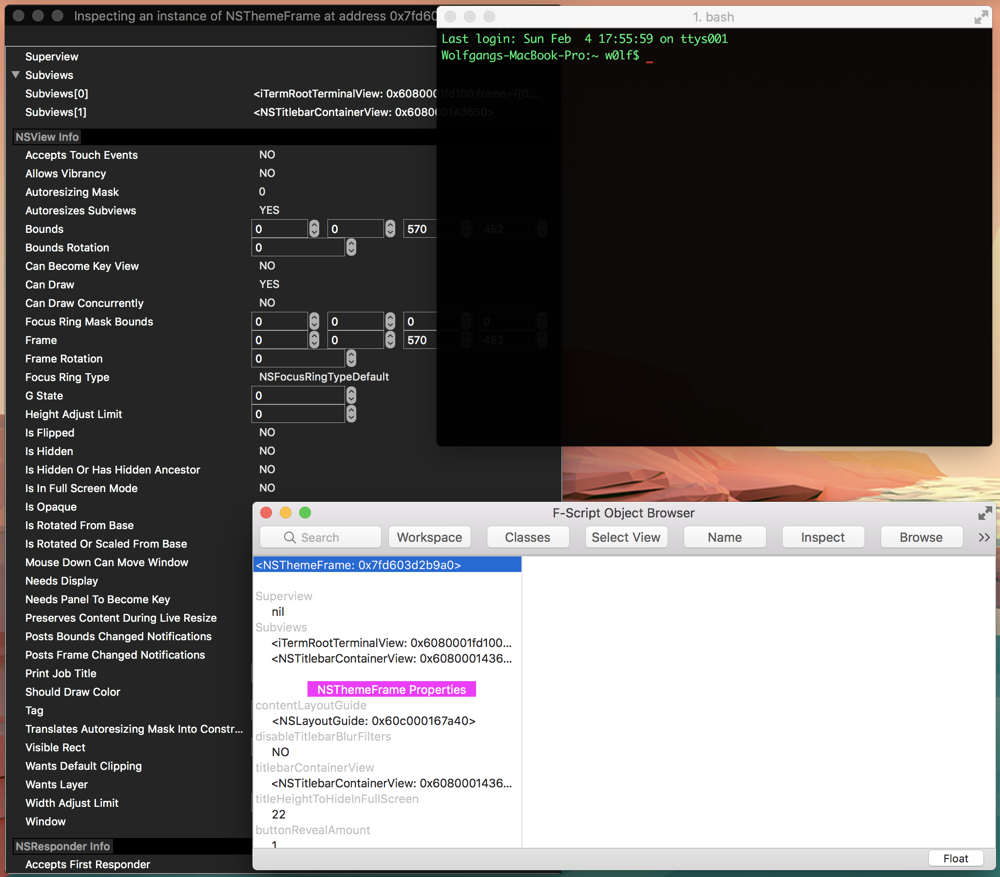

# FScriptLoader

# Information:

- Designed for 10.13+
- mySIMBL plugin to help explore cocoa applications on macOS
- Author: [w0lfschild](https://github.com/w0lfschild)

# Purpose
Runtime exploration of Objective-C and Objective-C++ programs through F-Script's Object Browser and Console.
Specifically, this plugin comes in handy when the program you want to explore disables debugger-attaching, or when the program has no menu bar. In these cases, use [MacForge](https://github.com/w0lfschild/app_updates/raw/master/MacForge/MacForge.zip) to load this plugin, and then use the shortcuts to control F-Script.

# Note:

- Based off code from [SIMBL-fscript](https://github.com/perfaram/SIMBL-fscript) by [perfaram](https://github.com/perfaram)
- Now has FScript bundled into the plugin and blacklist the `Dock.app` which crashes

# Installation:

1. Download [MacForge](https://github.com/w0lfschild/app_updates/raw/master/MacForge/MacForge.zip)
2. Open MacForge and search for FScriptLoader
3. Click `GET`
4. FScriptLoader should be automatically injected into all running processes and future process

# How to use:
* Use the newly created `F-Script` item in the app's main menu (in the top menu bar).
* Shortcuts : `⌘ + ⌥ + ⇧ + C` to show console, `⌘ + ⌥ + ⇧ + O` to show Object browser.
